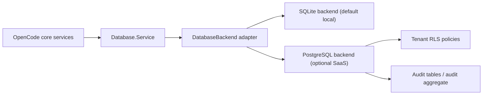

# PostgreSQL RLS migration plan

P4.2 designs a real PostgreSQL row-level-security path without replacing OpenCode's default SQLite backend.

## P4.3-P4.8 implementation status

The current implementation keeps PostgreSQL opt-in and fail-closed. It adds the migration seam and release contracts without changing the default SQLite runtime.

- P4.3 backend seam: `src/database/backend.ts` and `Database.layerFromBackend()` select SQLite by default and preserve `Database.layerFromPath()`.
- P4.4 PostgreSQL schema draft: `src/database/postgres/schema.ts` defines tenant columns, event-store indexes, audit table, and forced RLS policy SQL.
- P4.5 PostgreSQL adapter alpha: `src/database/postgres/index.ts` validates required PG/SaaS settings and fails closed because no driver-backed adapter is enabled yet.
- P4.6 dual-run validation: `src/database/postgres/dual-run.ts` defines release-blocking parity and negative tenant-isolation workloads.
- P4.7 migration tooling: `src/database/postgres/migration-tooling.ts` defines read-only SQLite export and tenant-mapped import validation contracts.
- P4.8 SaaS release gate: `src/database/postgres/release-gate.ts` blocks SaaS release without PostgreSQL, dual-run workload proof, RLS negative tests, and app-role RLS proof.

Plan-level validation is available through:

```bash
bun run --cwd packages/core test:postgres-rls-plan
```

## P4.9-P4.10 PostgreSQL driver and migration runner

P4.9 introduces the real PostgreSQL driver dependency and a standalone client module, but it still does not switch OpenCode's business runtime to PostgreSQL.

Implementation:

- `postgres@3.4.9` is added to `packages/core`.
- `src/database/postgres/client.ts` creates a `postgres` client from `OPENCODE_DATABASE_URL`.
- `src/database/postgres/client.ts` also provides transaction-scoped tenant context helpers using `set_config('opencode.*', ..., true)`.
- `Database.Service` still defaults to SQLite.
- `OPENCODE_DATABASE_BACKEND=postgres` remains fail-closed until the full adapter is implemented.

P4.10 adds a real migration runner for the PostgreSQL RLS schema draft.

Implementation:

- `src/database/postgres/migration.ts` applies staged SQL migrations transactionally.
- `src/database/postgres/migration.ts` writes a PostgreSQL-specific `opencode_pg_migration` journal.
- `assertRlsReady()` verifies that tenant-scoped tables exist, RLS is enabled, RLS is forced, and tenant-isolation policies exist.
- `script/postgres-rls-migrate.ts` runs the real migrations against `OPENCODE_DATABASE_URL`.
- `script/postgres-rls-migration-smoke.ts` validates the runner contract without touching a real database unless `OPENCODE_POSTGRES_RLS_SMOKE=1` is set.

Commands:

```bash
bun run --cwd packages/core test:postgres-rls-migration
```

```bash
OPENCODE_DATABASE_URL=postgres://... bun run --cwd packages/core postgres:rls:migrate
```

Real PostgreSQL smoke mode:

```bash
OPENCODE_POSTGRES_RLS_SMOKE=1 OPENCODE_DATABASE_URL=postgres://... bun run --cwd packages/core test:postgres-rls-migration
```

Status:

- P4.9 complete: driver and standalone client are present.
- P4.10 complete: migration runner and RLS readiness check are present.
- Runtime adapter remains intentionally pending: session/event/project services still run on SQLite by default.

## P4.11 PostgreSQL RLS smoke service

P4.11 adds a real PostgreSQL smoke service for tenant-isolation validation. It is opt-in and does not run against a database unless `OPENCODE_POSTGRES_RLS_SMOKE=1` and `OPENCODE_DATABASE_URL` are both set.

Implementation:

- `src/database/postgres/smoke-service.ts` applies migrations, verifies RLS readiness, rejects superuser or `BYPASSRLS` roles, seeds two tenants, and runs negative isolation checks.
- `script/postgres-rls-smoke-service.ts` is the script entrypoint.
- `test:postgres-rls-smoke-service` skips safely by default and only touches PostgreSQL in explicit smoke mode.

Checks:

- Runtime role is not superuser.
- Runtime role does not have `BYPASSRLS`.
- Tenant A can read its own session/event rows.
- Tenant B can read its own session/event rows.
- Tenant A cannot read Tenant B session/event rows.
- Tenant B cannot read Tenant A session/event rows.
- Tenant A cannot append to Tenant B aggregate.
- Tenant A cannot promote Tenant B pending input.
- Missing tenant context fails closed for reads and writes.

Default no-database smoke:

```bash
bun run --cwd packages/core test:postgres-rls-smoke-service
```

Real PostgreSQL RLS smoke:

```bash
OPENCODE_POSTGRES_RLS_SMOKE=1 OPENCODE_DATABASE_URL=postgres://... bun run --cwd packages/core test:postgres-rls-smoke-service
```

Status:

- P4.11 smoke service complete.
- Real adapter parity remains pending for P4.12+.

## P4.12 PostgreSQL EventStore adapter alpha

P4.12 adds a standalone PostgreSQL EventStore adapter for `event_sequence` and `event`. It does not replace `EventV2.Service`, does not start session projection on PostgreSQL, and does not alter the default SQLite runtime.

Implementation:

- `src/database/postgres/event-store.ts` provides `append`, `readAggregate`, and `latestSequence`.
- Append is scoped by `(tenant_id, aggregate_id)`.
- Append runs inside a transaction, sets tenant context, creates the sequence row if missing, locks it with `for update`, inserts the event, then advances the sequence.
- Read runs inside a tenant-scoped transaction and returns ordered events after a sequence boundary.
- `src/database/postgres/event-store-smoke.ts` verifies serial append, concurrent append, ordered read, tenant sequence isolation, latest sequence isolation, and missing-tenant fail-closed reads.
- `script/postgres-event-store-smoke.ts` is opt-in and skips unless `OPENCODE_POSTGRES_EVENT_STORE_SMOKE=1` is set.

Default no-database smoke:

```bash
bun run --cwd packages/core test:postgres-event-store-smoke
```

Real PostgreSQL EventStore smoke:

```bash
OPENCODE_POSTGRES_EVENT_STORE_SMOKE=1 OPENCODE_DATABASE_URL=postgres://... bun run --cwd packages/core test:postgres-event-store-smoke
```

Status:

- P4.12 EventStore alpha complete.
- Runtime `EventV2.Service` still uses SQLite by default.
- Session projection remains intentionally untouched.

## P4.13 EventStore dual-run harness

P4.13 adds a dual-run harness that executes the same durable event workload through SQLite `EventV2` and PostgreSQL EventStore alpha, then compares normalized sequence, order, type, and data.

Implementation:

- `src/database/postgres/event-store-dual-run.ts` creates a temporary SQLite database, publishes `SessionEvent.Audit.Recorded` events through real `EventV2`, writes the same workload through PostgreSQL EventStore alpha, reads both sides, and compares normalized output.
- `script/postgres-event-store-dual-run.ts` is opt-in and skips unless `OPENCODE_POSTGRES_EVENT_STORE_DUAL_RUN=1` is set.
- The harness uses an existing durable event from the manifest instead of a private test event, so SQLite readback follows the production `EventV2` durable decode path.

Default no-database smoke:

```bash
bun run --cwd packages/core test:postgres-event-store-dual-run
```

Real PostgreSQL dual-run:

```bash
OPENCODE_POSTGRES_EVENT_STORE_DUAL_RUN=1 OPENCODE_DATABASE_URL=postgres://... bun run --cwd packages/core test:postgres-event-store-dual-run
```

Status:

- P4.13 dual-run harness complete.
- Session projection remains intentionally untouched.

## P4.14 EventV2-compatible facade alpha

P4.14 adds a standalone EventV2-compatible facade over PostgreSQL EventStore alpha. It intentionally implements only durable `publish()` and `readAggregate()` compatibility.

Implementation:

- `src/database/postgres/event-v2-facade.ts` exposes `make({ sql, tenant, ownerID })`.
- The facade is intentionally not exported from `src/database/postgres/index.ts` because it imports `EventV2`; exporting it from the PostgreSQL barrel would create an `EventV2 -> Database -> PostgreSQL barrel -> EventV2` initialization cycle.
- `publish(definition, data, options)` accepts durable EventV2 definitions, encodes data through the definition schema, writes through PostgreSQL EventStore alpha, and returns an EventV2-style payload with logical type and durable metadata.
- `readAggregate({ aggregateID, after, limit, manifest })` reads from PostgreSQL, maps versioned physical types back to logical manifest types, and decodes through the manifest schema.
- Non-durable publish is rejected.
- Projectors, subscriptions, streams, replay, remove, and claim are intentionally not implemented in this phase.

Default no-database smoke:

```bash
bun run --cwd packages/core test:postgres-event-v2-facade-smoke
```

Real PostgreSQL facade smoke:

```bash
OPENCODE_POSTGRES_EVENT_V2_FACADE_SMOKE=1 OPENCODE_DATABASE_URL=postgres://... bun run --cwd packages/core test:postgres-event-v2-facade-smoke
```

Status:

- P4.14 facade alpha complete.
- Runtime `EventV2.Service` still uses SQLite by default.
- Session projection remains intentionally untouched.

## Decision

Keep SQLite as the default and supported local backend.

Add PostgreSQL as an optional SaaS backend behind an explicit database adapter boundary. PostgreSQL must not be enabled by silently changing `Database.Service`, the existing `OPENCODE_DB` SQLite file path, or SQLite migrations.

## Current SQLite boundary

Current storage is SQLite-specific at these seams:

- `src/database/database.ts` imports `#sqlite`, builds `Database.Service` from `EffectDrizzleSqlite.makeWithDefaults()`, and applies SQLite pragmas before migrations.
- `src/database/sqlite.bun.ts` uses `bun:sqlite` and `drizzle-orm/bun-sqlite`.
- `src/database/migration.ts` introspects `sqlite_master` and applies SQLite SQL generated from `src/database/schema.gen.ts`.
- Table definitions under `src/session/sql.ts`, `src/event/sql.ts`, and `src/project/sql.ts` use `drizzle-orm/sqlite-core`.
- Durable event ordering depends on `event_sequence.aggregate_id`, `event.seq`, and unique `(aggregate_id, seq)`.
- Session inbox correctness depends on the `session_input` sequence contract: `prompt.admitted` is projected before `prompted`; governance events must be after `prompted` or outside the session aggregate.

## Non-goals for P4.2

- Do not replace SQLite.
- Do not add a PostgreSQL driver dependency yet.
- Do not rewrite session runner, tool execution, prompt admission, or model invocation logic.
- Do not claim production RLS from the current `logical-sqlite` governance events.
- Do not migrate user data automatically.

## Target architecture



The application-facing API should stay close to the current `Database.Service` contract. Backend selection must be explicit:

- `OPENCODE_DATABASE_BACKEND=sqlite` keeps current behavior.
- `OPENCODE_DATABASE_BACKEND=postgres` enables PostgreSQL only when `OPENCODE_DATABASE_URL` is present.
- If neither is set, default to SQLite.

## Adapter split

Create a backend-neutral database module before adding PostgreSQL:

- `src/database/database.ts` remains the public service.
- `src/database/backend.ts` defines backend selection and common config.
- `src/database/sqlite/index.ts` owns the current SQLite layer, pragmas, and migrations.
- `src/database/postgres/index.ts` later owns the PostgreSQL client, migration runner, and session settings.

Acceptance criteria:

- SQLite typecheck and current targeted tests remain unchanged.
- Existing `OPENCODE_DB` path behavior is preserved.
- No PostgreSQL code path is reachable unless explicitly selected.

## PostgreSQL schema strategy

Do not try to reuse `sqlite-core` table definitions directly. Create parallel PostgreSQL table definitions with `drizzle-orm/pg-core`.

Required table groups:

- `project`, `project_directory`
- `session`, `message`, `part`, `todo`
- `session_message`, `session_input`, `session_context_epoch`
- `event_sequence`, `event`
- `migration`
- `tenant`, `tenant_member`, and optional `workspace_tenant_binding`
- `audit_event` if prompt/session audit is moved to an independent audit aggregate

Type mapping:

- SQLite `text({ mode: "json" })` becomes PostgreSQL `jsonb`.
- SQLite `integer` timestamps remain epoch milliseconds as `bigint` or move to `timestamptz` only behind explicit migration code.
- SQLite `real` cost remains numeric-compatible, preferably `numeric` for SaaS billing accuracy.
- Existing IDs remain text-compatible.

Index parity:

- Preserve unique `(aggregate_id, seq)` on `event`.
- Preserve `(aggregate_id, type, seq)` for event replay filters.
- Preserve unique `(session_id, seq)` on `session_message`.
- Preserve `session_input` pending inbox index by `(session_id, promoted_seq, delivery, admitted_seq)`.
- Add tenant-prefixed indexes where RLS-filtered queries need them, for example `(tenant_id, session_id)` and `(tenant_id, time_created)`.

## Tenant model

PostgreSQL must carry tenant identity in storage, not only in event payloads.

Minimum columns:

- `session.tenant_id text not null`
- `event.tenant_id text not null`
- `event_sequence.tenant_id text not null`
- `session_message.tenant_id text not null`
- `session_input.tenant_id text not null`
- `audit_event.tenant_id text not null`

Recommended columns:

- `session.team_id text`
- `session.actor_id text`
- `event.actor_id text`
- `audit_event.actor_id text`
- `audit_event.action text not null`
- `audit_event.resource_type text not null`
- `audit_event.resource_id text not null`
- `audit_event.outcome text not null`

Tenant source of truth:

- The application must derive tenant context server-side.
- Client-supplied tenant IDs must be treated as hints only or rejected.
- PostgreSQL requests must set tenant context per transaction.

## RLS policy model

Use transaction-scoped settings:

```sql
select set_config('opencode.tenant_id', $1, true);
select set_config('opencode.actor_id', $2, true);
select set_config('opencode.team_id', $3, true);
```

Enable and force RLS:

```sql
alter table session enable row level security;
alter table session force row level security;
alter table event enable row level security;
alter table event force row level security;
alter table event_sequence enable row level security;
alter table event_sequence force row level security;
alter table session_message enable row level security;
alter table session_message force row level security;
alter table session_input enable row level security;
alter table session_input force row level security;
```

Example policy:

```sql
create policy tenant_isolation_session on session
using (tenant_id = current_setting('opencode.tenant_id', true))
with check (tenant_id = current_setting('opencode.tenant_id', true));
```

Apply equivalent policies to `event`, `event_sequence`, `session_message`, `session_input`, and `audit_event`.

Service-role rule:

- The application role must not be table owner if `force row level security` is not in place.
- Migration/admin roles can bypass RLS only for migrations and controlled repair jobs.
- Runtime queries must use the RLS-bound app role.

## Durable event sequencing under PostgreSQL

SQLite currently serializes writes through a single local connection. PostgreSQL needs explicit concurrency control.

Required rule:

- Append events inside one transaction.
- Lock the aggregate sequence row before calculating the next sequence.
- Insert event rows with the final contiguous sequence.
- Commit projections and durable events atomically where current semantics require it.

Reference algorithm:

```sql
select seq
from event_sequence
where tenant_id = $tenant_id and aggregate_id = $aggregate_id
for update;

insert into event (..., tenant_id, aggregate_id, seq, type, data)
values (...);

update event_sequence
set seq = $last_seq
where tenant_id = $tenant_id and aggregate_id = $aggregate_id;
```

Acceptance criteria:

- Concurrent prompt admission cannot duplicate sequence numbers.
- Concurrent promotion cannot skip `session_input.promoted_seq`.
- Replay returns a gap-free sequence per `(tenant_id, aggregate_id)`.

## Audit placement

P4.1 records prompt audit after `prompted` in the session aggregate.

For PostgreSQL SaaS, prefer an independent `audit_event` table or audit aggregate for compliance-grade retention.

Recommended split:

- Keep lightweight durable governance events in the session aggregate for replay/debugging.
- Write compliance-grade audit to `audit_event` in the same transaction when possible.
- If same-transaction audit is not possible, use an outbox table with retry and idempotency.

Audit records must include:

- `tenant_id`
- `actor_id`
- `action`
- `resource_type`
- `resource_id`
- `outcome`
- `request_id` or event id
- `created_at`
- immutable metadata JSON

## Migration phases

### P4.2 Design only

Deliver this plan and keep runtime untouched.

Exit criteria:

- Current SQLite path is documented.
- Postgres/RLS backend target is defined.
- RLS acceptance criteria are explicit.

### P4.3 Backend seam

Add a backend adapter seam while keeping only SQLite implemented.

Exit criteria:

- `OPENCODE_DATABASE_BACKEND=sqlite` is default.
- Existing tests pass unchanged.
- No PostgreSQL dependency is required.

### P4.4 PostgreSQL schema draft

Add PostgreSQL schema definitions and SQL migrations behind an unreachable or explicitly disabled path.

Exit criteria:

- Schema compiles.
- Generated SQL includes tenant columns, RLS enablement, forced RLS, policies, and indexes.
- No runtime code uses PostgreSQL by default.

### P4.5 PostgreSQL adapter alpha

Add the PostgreSQL adapter behind explicit env vars.

Exit criteria:

- Connection requires `OPENCODE_DATABASE_BACKEND=postgres` and `OPENCODE_DATABASE_URL`.
- Startup fails closed if RLS policies are missing.
- Transaction wrapper sets `opencode.tenant_id` and `opencode.actor_id`.

### P4.6 Dual-run validation

Run targeted session/event workloads against both SQLite and PostgreSQL.

Exit criteria:

- Prompt admission and promotion behavior matches SQLite.
- Durable worker replay matches SQLite.
- Model invocation and tool governance events are preserved.
- Cross-tenant reads and writes fail under PostgreSQL RLS.

### P4.7 Migration tooling

Add explicit export/import tooling.

Exit criteria:

- SQLite export is read-only.
- PostgreSQL import maps every session to a tenant.
- Import is idempotent.
- Rollback plan is documented.

### P4.8 SaaS release gate

Allow PostgreSQL backend only after real RLS tests pass in CI.

Exit criteria:

- RLS integration tests use a real PostgreSQL instance.
- App role cannot bypass tenant policies.
- Admin role is isolated from runtime.
- Audit retention and replay behavior are verified.

## Test plan

SQLite regression:

```bash
bun run --cwd packages/schema typecheck
bun run --cwd packages/core typecheck
bun run --cwd packages/opencode typecheck
cd packages/core && bun test test/session-prompt.test.ts test/session-runner-recorded.test.ts test/session-runner.test.ts --timeout 30000
```

PostgreSQL RLS validation after the adapter exists:

```bash
OPENCODE_DATABASE_BACKEND=postgres \
OPENCODE_DATABASE_URL=postgres://... \
OPENCODE_TENANT_ID=tenant_a \
bun test test/session-postgres-rls.test.ts --timeout 30000
```

Required negative tests:

- Tenant A cannot list Tenant B sessions.
- Tenant A cannot read Tenant B durable events by aggregate id.
- Tenant A cannot append to Tenant B aggregate.
- Tenant A cannot promote Tenant B pending input.
- Runtime app role cannot bypass RLS with an unset tenant setting.
- Missing `opencode.tenant_id` fails closed.

## Rollback strategy

- SQLite remains default and unchanged.
- PostgreSQL backend is opt-in.
- Keep migrations separate by backend.
- Keep data migration tooling one-way until export verification is complete.
- If PostgreSQL validation fails, unset `OPENCODE_DATABASE_BACKEND=postgres` and continue using SQLite.

## Production readiness boundary

`logical-sqlite` governance events are useful for replay and audit intent, but they are not real database isolation.

Only the PostgreSQL path can be called production RLS when all of the following are true:

- Tenant IDs are stored in relational columns.
- RLS is enabled and forced on tenant-scoped tables.
- The runtime role is subject to RLS.
- Transaction-scoped tenant settings are mandatory.
- Cross-tenant negative tests pass against real PostgreSQL.
- Audit records are immutable or append-only with controlled admin access.

## P4.15 EventV2 facade replay/remove/claim subset

The PostgreSQL EventV2-compatible facade now includes an alpha subset for durable-only `replay`, `remove`, and `claim` operations. This remains intentionally disconnected from projectors, stream subscription, and session projection.

Scope:

- `replay` accepts serialized durable EventV2 events, validates the durable manifest entry, enforces per-tenant context, and commits only the next contiguous sequence.
- Stale `replay` is idempotent only when the existing event has the same id, type, and JSON payload. Divergent stale replays fail closed.
- `claim` sets or updates the aggregate owner in `event_sequence` for future strict-owner replay checks.
- `remove` deletes the aggregate sequence row and relies on the event foreign-key cascade to remove stored events.

Non-goals for this phase:

- No projector integration.
- No stream subscription integration.
- No session projection integration.
- No default database backend switch away from SQLite.

Import caveat:

- Import `event-v2-facade` directly from `packages/core/src/database/postgres/event-v2-facade.ts`. Do not export it from the PostgreSQL barrel while core EventV2 still imports the generic database seam, otherwise a startup initialization cycle can be introduced.

## P4.16 PostgreSQL migration advisory lock

`applyMigrations` now takes a transaction-scoped PostgreSQL advisory lock before creating or reading the migration table. The lock key is scoped by the current schema so concurrent OpenCode processes targeting the same schema serialize migration setup, while independent schemas do not unnecessarily share one global migration lock.

This prevents the PostgreSQL catalog race where parallel `create table if not exists opencode_pg_migration` calls can still collide on the underlying `pg_type_typname_nsp_index` entry before the migration table is visible to competing transactions.

Acceptance:

- Multiple processes may call `applyMigrations` concurrently for the same schema.
- Exactly one process applies pending migrations.
- Other processes wait, then observe the completed migration ids as skipped.
- No projector, stream, or session projection path is changed.

## P4.17 EventV2 facade contract test

The PostgreSQL EventV2 facade now has a contract harness that runs the same durable audit workload through SQLite EventV2 and the PostgreSQL facade, then compares normalized event sequence, order, type, and payload data.

Covered operations:

- `publish`
- `readAggregate`
- `replay`
- `remove`
- `claim`
- replay idempotency
- replay conflict rejection
- strict owner rejection after claim

The contract test is intentionally separate from OpenCode projectors and session projection. Its purpose is to lock EventV2-compatible event semantics before any projector integration is attempted.

## P4.18 Live capability fail-closed boundary

The PostgreSQL EventV2 facade alpha now explicitly rejects live EventV2 capabilities that are not implemented in this phase:

- `subscribe`
- `all`
- `durable` stream
- `listen`
- `project`

The SaaS release gate also blocks PostgreSQL alpha configurations that attempt to enable projector, stream subscription, or session projection. This prevents the alpha facade from being mistaken for a complete EventV2 backend.

## P4.19 Session projector dry-run harness

A PostgreSQL session projection dry-run harness now runs the same durable session workload through SQLite EventV2 and the PostgreSQL EventV2 facade. It reads the resulting durable aggregate events from each backend, applies the existing in-memory `SessionMessageUpdater` projection rules, and compares a normalized projection summary.

This is intentionally a dry-run harness:

- It does not register OpenCode live projectors.
- It does not write `session_message` or `session_input` production projection rows.
- It does not alter the OpenCode session read path.

## P4.20 PostgreSQL shadow session projection

PostgreSQL now has an isolated `pg_session_projection_shadow` table for storing dry-run projection summaries. The table is tenant scoped, protected by forced RLS, and used only by the alpha dry-run harness.

Shadow projection stores:

- session id
- aggregate id
- source label
- last durable sequence
- event/message/input counts
- normalized projection JSON
- projection hash

This table is not a production session projection and is not read by OpenCode session APIs.

## P4.21 Worker event alignment

The PostgreSQL alpha path now has a worker lifecycle alignment harness. It runs scheduled/resumed/lease/started/stop-requested/stopped/completed events through SQLite EventV2 and the PostgreSQL EventV2 facade, then compares normalized lifecycle timelines.

Covered worker semantics:

- wake scheduling
- resume scheduling
- lease acquired/heartbeat/released
- stop requested/stopped
- completed
- replay idempotency
- claim-based strict owner rejection

This remains an EventStore/facade validation harness only. It does not move OpenCode worker execution onto PostgreSQL and does not change the default SQLite runtime path.

## P4.22 SaaS release gate proof

The SaaS release gate now accepts structured PostgreSQL proof instead of relying only on loose booleans. Release proof includes migrations, advisory-lock validation, RLS readiness, negative RLS tests, runtime role checks, EventV2 facade contract, worker event alignment, session projection shadow validation, and confirmation that PG alpha projector/stream/session-projection paths remain disabled.

This keeps PostgreSQL alpha release eligibility explicit and fail-closed while SQLite remains the default backend.

## P4.23 PostgreSQL alpha backend switch and startup gate

`OPENCODE_DATABASE_BACKEND=postgres-alpha` enables the PostgreSQL alpha sidecar while retaining SQLite as the primary OpenCode database. Layer construction runs a PostgreSQL startup gate before exposing the SQLite database service.

The startup gate requires:

- `OPENCODE_DATABASE_URL`
- forced RLS configuration
- tenant and actor identity
- migrated tenant-scoped tables with enabled and forced RLS policies
- a runtime PostgreSQL role that is neither superuser nor `BYPASSRLS`

The alpha switch permits only the durable EventV2 facade and session projection dry-run/shadow paths. These live paths remain fail-closed:

- `OPENCODE_POSTGRES_ALPHA_PROJECTOR_ENABLED`
- `OPENCODE_POSTGRES_ALPHA_STREAM_ENABLED`
- `OPENCODE_POSTGRES_ALPHA_SESSION_PROJECTION_ENABLED`

The legacy `OPENCODE_DATABASE_BACKEND=postgres` path remains unavailable. P4.23 does not replace SQLite session projections, register PostgreSQL projectors, or subscribe PostgreSQL streams.

Validation:

```sh
bun run --cwd packages/core test:postgres-alpha-startup

OPENCODE_POSTGRES_ALPHA_SMOKE=1 \
OPENCODE_DATABASE_URL=postgres://... \
bun run --cwd packages/core test:postgres-alpha-startup
```

## P4.24 Real PostgreSQL release proof

The release-proof generator now executes the real migration advisory-lock check, forced-RLS negative tests, EventStore dual-run, EventV2 facade contract, worker event alignment, and session projection shadow validation. It writes a time-limited JSON artifact containing the release environment, build id, database fingerprint, runtime role, schema name, PostgreSQL schema hash, evidence, digest, and HMAC signature.

```sh
OPENCODE_DATABASE_URL=postgres://... \
OPENCODE_RELEASE_ENV=staging \
OPENCODE_BUILD_ID=build-123 \
OPENCODE_POSTGRES_RELEASE_PROOF_KEY=... \
OPENCODE_POSTGRES_RELEASE_PROOF_OUTPUT=/secure/opencode-pg-proof.json \
bun run --cwd packages/core postgres:release-proof:generate
```

## P4.25 SaaS startup release-proof gate

When `OPENCODE_SAAS_RELEASE=1` and `OPENCODE_DATABASE_BACKEND=postgres-alpha`, startup now requires the generated release proof. Startup rejects missing, expired, tampered, wrong-environment, wrong-build, wrong-database, wrong-role, and stale-schema proof artifacts. The transactional replication outbox must also be enabled.

Required runtime settings:

- `OPENCODE_POSTGRES_RELEASE_PROOF_PATH`
- `OPENCODE_POSTGRES_RELEASE_PROOF_KEY`
- `OPENCODE_RELEASE_ENV`
- `OPENCODE_BUILD_ID`
- `OPENCODE_POSTGRES_ALPHA_DUAL_WRITE_ENABLED=1`

## P4.26 SQLite transactional PostgreSQL replication outbox

When `OPENCODE_POSTGRES_ALPHA_DUAL_WRITE_ENABLED=1`, durable EventV2 append/replay, claim, and remove operations enqueue PostgreSQL replication records in the same SQLite transaction as the authoritative operation. SQLite remains the primary store and PostgreSQL remains an asynchronous shadow target.

The feature is disabled by default. No projector, stream, or session read path is changed.

## P4.27 PostgreSQL replication worker and reconciliation

The standalone worker claims outbox rows with expiring SQLite leases, drains them in commit order, uses PostgreSQL replay idempotency, retries transient failures, and records terminal dead letters. Reconciliation compares applied append rows against PostgreSQL id, sequence, type, and payload data.

```sh
OPENCODE_DATABASE_BACKEND=postgres-alpha \
OPENCODE_POSTGRES_ALPHA_DUAL_WRITE_ENABLED=1 \
OPENCODE_DATABASE_URL=postgres://... \
bun run --cwd packages/core postgres:replication:worker
```

Set `OPENCODE_POSTGRES_REPLICATION_MODE=continuous` for a long-running sidecar worker. Metrics include pending, applied, leased, dead-letter, oldest pending lag, and reconciliation divergences.

## P4.28 PostgreSQL worker lease and fencing token

PostgreSQL now provides a forced-RLS `worker_lease` coordination table and a `worker_effect` idempotency journal. Lease acquisition locks the run row and increments a monotonic fencing token whenever an expired, released, or completed lease is taken over.

Heartbeat, release, completion, and guarded effect commits require the current tenant, owner, active lease, unexpired deadline, and exact fencing token. A stale process cannot extend the lease or commit a guarded effect after takeover.

This API is a coordination seam for durable workers. It does not yet replace the OpenCode session runner or make external services transactional; external side effects must still accept an idempotency key or fencing token.

## P4.29 Multi-process worker chaos validation

The chaos harness starts real Bun worker processes against PostgreSQL and validates:

- one process acquires and is terminated with `SIGKILL`
- another process cannot acquire before lease expiry
- two processes race after expiry and exactly one wins
- the takeover fencing token is greater than the killed owner's token
- the stale owner cannot commit a guarded effect
- a repeated effect key remains one durable effect row
- worker lease rows remain tenant-isolated by forced RLS

```sh
OPENCODE_POSTGRES_WORKER_LEASE_CHAOS=1 \
OPENCODE_DATABASE_URL=postgres://... \
bun run --cwd packages/core test:postgres-worker-lease-chaos
```

P4.28-P4.29 results are included in generated PostgreSQL ReleaseProof artifacts.

## P4.30 SessionExecution PostgreSQL coordination adapter

The real PostgreSQL lease service is now connected at the `SessionExecution` drain boundary behind tenant-scoped feature flags. A process must acquire the Session run lease before invoking `SessionRunner`; live contenders do not run a duplicate provider turn.

The adapter maintains PostgreSQL heartbeat while the runner is active. Lease loss interrupts the runner. Successful drains complete the lease; stopped or failed drains release it.

## P4.31 Fencing propagation to model and tool boundaries

The current fencing token is passed into `SessionRunner`. Every model turn and local tool settlement validates the active PostgreSQL fence before side effects begin. Tool contexts expose the run id, owner, token, and deterministic idempotency key so application tools and external integrations can forward fencing metadata.

ReleaseProof now requires the coordination adapter and fence-propagation smoke checks in addition to P4.28-P4.29 chaos evidence.

## P4.32 PostgreSQL durable worker queue

PostgreSQL now provides a forced-RLS `worker_job` queue for Session execution dispatch. `wake` and `resume` increment a monotonic requested generation. A claim snapshots that generation, receives a monotonic claim token, and can complete only while its owner/token/deadline remain current.

If another generation arrives while a job is running, completion advances only the claimed generation and atomically returns the row to pending. Consumers use `FOR UPDATE SKIP LOCKED`, while execution itself remains guarded by the separate P4.30-P4.31 worker lease and fencing token.

## P4.33 Cross-process recovery

Enabled SessionExecution services start a scoped queue consumer that scans pending jobs and expired running claims at startup. An expired claim is marked as recovery work and can be taken by exactly one process. The multi-process chaos harness validates:

- a claimed process is terminated with `SIGKILL`
- contenders are blocked before claim expiry
- exactly one contender takes over after expiry
- the claim token increases
- the killed owner's completion is rejected
- a generation enqueued during execution is not lost
- forced RLS hides the job from another tenant

```sh
OPENCODE_POSTGRES_WORKER_QUEUE_SMOKE=1 \
OPENCODE_DATABASE_URL=postgres://... \
bun run --cwd packages/core test:postgres-worker-queue

OPENCODE_POSTGRES_WORKER_JOB_CHAOS=1 \
OPENCODE_DATABASE_URL=postgres://... \
bun run --cwd packages/core test:postgres-worker-job-chaos
```

P4.32-P4.33 evidence is required by generated PostgreSQL ReleaseProof artifacts. SQLite remains authoritative for Session projections in this phase.

## P4.34 Worker queue operations

The PostgreSQL queue now exposes tenant-scoped readiness, status metrics, and failed/cancelled job listing through an operations CLI. Operator requeue is compare-and-set guarded by the current requested generation and claim token. A successful requeue increments generation and writes `worker_job.requeue` to `audit_event` in the same transaction.

No HTTP administration route is enabled in this phase.

## P4.35 Operational recovery validation

The operations smoke service validates terminal failure visibility, degraded readiness, forced-RLS isolation, stale-token rejection, concurrent operator single-winner behavior, atomic audit, recovered execution, and readiness recovery.

```sh
OPENCODE_POSTGRES_WORKER_QUEUE_OPERATIONS_SMOKE=1 \
OPENCODE_DATABASE_URL=postgres://... \
bun run --cwd packages/core test:postgres-worker-queue-operations
```

P4.34-P4.35 operations and tenant-isolation evidence are required by PostgreSQL ReleaseProof.

## P4.36 OpenTelemetry and Prometheus queue metrics

Queue runtime sampling now updates OpenTelemetry gauges for status counts, expired claims, pending age, readiness, and degradation. Operator request/approval/execution outcomes use an OpenTelemetry counter. When OTLP is configured, metrics are exported to `${OTEL_EXPORTER_OTLP_ENDPOINT}/v1/metrics`.

Prometheus text exposition is available from the signed worker queue management API and contains tenant/team labels but never actor identity.

## P4.37 Membership, role, and approval-protected management API

The management API is disabled by default and mounted under `/experimental/worker-queue`. It layers per-actor HMAC request authentication and nonce replay protection after OpenCode server Basic Auth. PostgreSQL then verifies both tenant membership and configured team role under forced RLS.

Requeue is a persistent action aggregate. Operators may request recovery; two distinct `admin`/`owner` approvals are required before the existing generation/claim-token CAS requeue executes. Request, approvals, and execution are auditable.

P4.37 also enables forced RLS on the existing `tenant_member` and `workspace_tenant_binding` tables and adds forced-RLS team membership, nonce, action, and approval tables.
